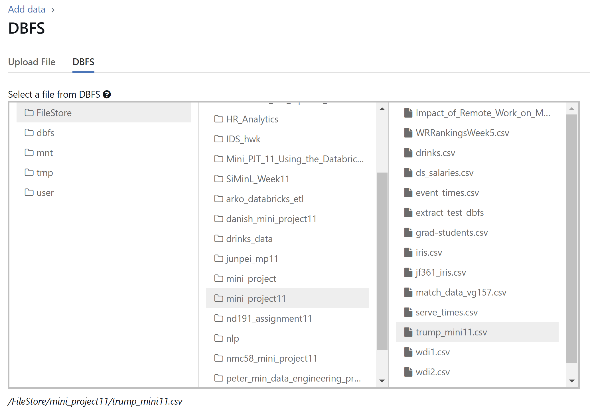
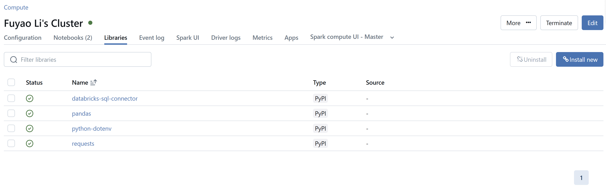

[](https://github.com/nogibjj/Mini_Proj11_Fuyao_Li/actions/workflows/cicd.yml)
# Mini Project 11

### Fuyao Li

## Requirements
+ Create a data pipeline using Databricks
+ Include at least one data source and one data sink

## Project Structure
1. Extracting Data
+ A dataset is fetched from a public URL (e.g., Kaggle, GitHub).
+ The data is saved to a temporary local file (/tmp) and then copied to Databricks FileStore (dbfs:/FileStore/mini_project11/).
+ Loading Data into Databricks

2. The dataset is read into a PySpark DataFrame with a specified schema.
+ A Delta table is created in Databricks under the specified catalog, database, and table name.
+ The data is saved as a Delta table for querying.

3. Query Task
+ Filters rows from the input Delta table where lat > 40.
+ Saves the result to a new Delta table in a specified catalog and database.

4. Transform Task
+ Reads the input Delta table.
+ Adds a new column named Region based on the longitude (lng) value:
    - West: lng < -100
    - Central: -100 <= lng < -80
    - East: lng >= -80
+ Saves the transformed data to a new Delta table.


## Databricks Operation
1. Create a new Compute

2. Install pickages

3. Upload the file

4. Required databases


## Installation
+ Clone the repository:
``` shell
git@github.com:nogibjj/Mini_Proj11_Fuyao_Li.git
```
+ Set up environment:
``` shell
pip install -r requirements.txt
```

## Project Structure
```plaintext
Mini Proj11/
│
├── mylib/                    
│   ├── calculator.py          
├── data/                     
│   └── trump.csv
|
├── README.md                
├── requirements.txt          
|── main.py                   
└── test_main.py
```


## References
https://github.com/nogibjj/python-ruff-template

## Data resource:
https://github.com/fivethirtyeight/data/blob/master/presidential-campaign-trail/trump.csv
