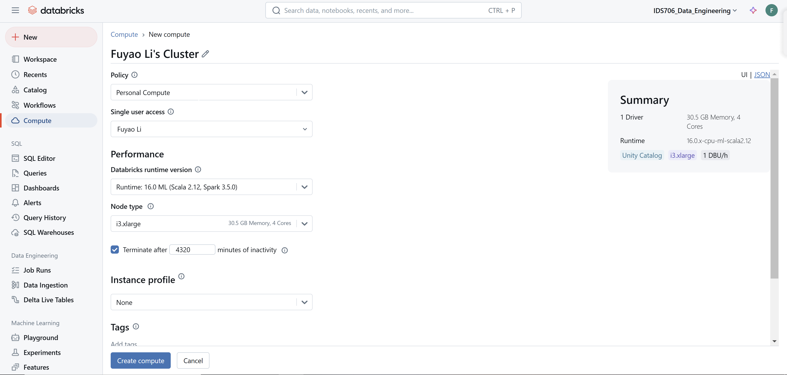
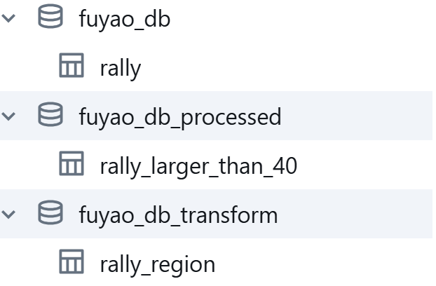

[](https://github.com/nogibjj/Mini_Proj11_Fuyao_Li/actions/workflows/cicd.yml)
# Mini Project 11

### Fuyao Li

## Requirements
+ Create a data pipeline using Databricks
+ Include at least one data source and one data sink

## Project Structure
1. Extracting Data
+ A dataset is fetched from a public URL (e.g., Kaggle, GitHub).
+ The data is saved to a temporary local file (/tmp) and then copied to Databricks FileStore (dbfs:/FileStore/mini_project11/).
+ Loading Data into Databricks

2. The dataset is read into a PySpark DataFrame with a specified schema.
+ A Delta table is created in Databricks under the specified catalog, database, and table name.
+ The data is saved as a Delta table for querying.

3. Query Task
+ Filters rows from the input Delta table where lat > 40.
+ Saves the result to a new Delta table in a specified catalog and database.

4. Transform Task
+ Reads the input Delta table.
+ Adds a new column named Region based on the longitude (lng) value:
    - West: lng < -100
    - Central: -100 <= lng < -80
    - East: lng >= -80
+ Saves the transformed data to a new Delta table.


## Databricks Operation
1. Create a new Compute


2. Install pickages


3. Upload the file


4. Required databases


## Databases
#### Database: `fuyao_db`
- Table: `rally`
  - Description: This is the original table containing the data extracted from the source (e.g., CSV or API). It includes all the rows and columns from the original dataset.
  - Purpose: Acts as the starting point for further processing and transformations.

#### Database: `fuyao_db_processed`
- Table: `rally_larger_than_40`
  - Description This table contains a filtered subset of the data from the `rally` table where the latitude (`lat`) is greater than 40.
  - Columns Inherits the schema from the original table.

#### Database: `fuyao_db_transform`
- Table: `rally_region`
  - Description: This table adds a new column `Region` to the `rally` data based on the longitude (`lng`) values:
    - `West`: Longitude less than -100.
    - `Central`: Longitude between -100 and -80.
    - `East`: Longitude greater than or equal to -80.
  - Columns:
    - Original columns from the `rally` table.
    - A new column: `Region` indicating the geographic region.

## Installation
+ Clone the repository:
``` shell
git@github.com:nogibjj/Mini_Proj11_Fuyao_Li.git
```
+ Set up environment:
``` shell
pip install -r requirements.txt
```

## Project Structure
```plaintext
Mini_Proj11_Fuyao_Li/
├── .github/
│   └── workflows/
│       └── cicd.yml
├── mylib/
│   ├── extract.py
│   ├── load.py
│   ├── query.py
│   └── transform.py
├── main.py
├── Makefile
├── README.md
└── test_main.py
```


## References
https://github.com/nogibjj/python-ruff-template

## Data resource:
https://github.com/fivethirtyeight/data/blob/master/presidential-campaign-trail/trump.csv
